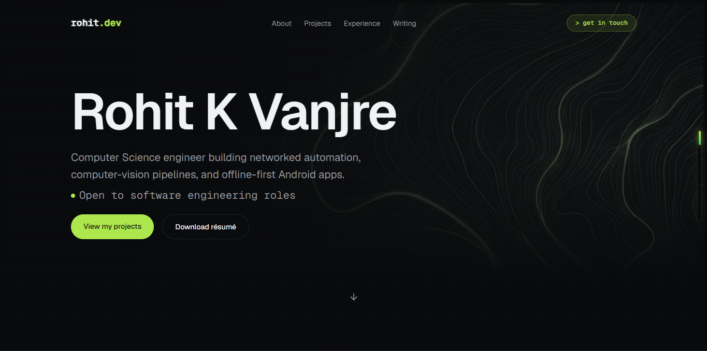

# rohit.dev — portfolio

My personal portfolio site. Hand-written HTML, CSS and JavaScript —
no frameworks, no build step, no dependencies.

**Live:** https://rohit-k-vanjre-portfolio.vercel.app



---

## Why it's built this way

I could have shipped this with Next.js in an afternoon. I built it by hand
instead, because I wanted to actually understand the layout, the cascade and
the DOM rather than the abstraction sitting on top of them.

Everything here is `index.html`, `style.css` and `script.js`. Clone it and
open the HTML file — that's the whole setup.

---

## Features

- **Fluid across every screen size** — `clamp()` scales type and layout
  continuously from a 375px phone to an ultrawide, rather than jumping at
  fixed breakpoints
- **Scroll-reveal animations** using `IntersectionObserver`
- **Active nav highlighting** that tracks the section you are reading
- **Scroll-aware header** — transparent over the hero, frosted once you scroll
- **Custom scroll progress rail** and a back-to-top control
- **Category filtering** on the project grid
- **Accessible mobile menu** driven by `aria-expanded`
- **Click-to-copy** email in the contact section
- **Respects `prefers-reduced-motion`** — all animation is disabled for
  visitors who ask for it

---

## Built with

| | |
|---|---|
| Markup | Semantic HTML5, validated against the W3C checker |
| Styling | CSS custom properties, Flexbox, Grid, `clamp()`, `oklch()` colours |
| Behaviour | Vanilla JavaScript — `IntersectionObserver`, Clipboard API |
| Fonts | Geist and Geist Mono |
| Hosting | Vercel, deployed from `main` on every push |
| Analytics | Microsoft Clarity |

No npm, no bundler, no CSS framework.

---

## Structure

```
.
├── index.html      # every section, one page
├── style.css       # design tokens, layout, responsive rules
├── script.js       # header state, menu, scroll effects, filtering
├── images/         # hero background and profile photo, all WebP
└── files/          # résumé
```

---

## Running it locally

```bash
git clone https://github.com/rohitkvanjre/Rohit_K_Vanjre_Portfolio.git
cd Rohit_K_Vanjre_Portfolio
```

Open `index.html` in a browser. That's it.

For live reloading while editing, the VS Code **Live Server** extension works
well.

---

## A few implementation notes

**Dark scrollbar and native UI** — `color-scheme: dark` on `:root` tells the
browser to render scrollbars, form controls and selection highlights to match
the page, in one line.

**Animating to an unknown height** — the project descriptions expand on hover
by transitioning `grid-template-rows` from `0fr` to `1fr`, which animates to
the content's real height. `max-height` guesswork isn't needed.

**Hover only where hover exists** — collapse-on-hover is wrapped in
`@media (hover: hover)`, so touch devices show the content permanently
instead of hiding it behind an interaction they cannot perform.

**Images** — the hero background went from a 1.2 MB PNG to a 92 KB WebP, a
93% reduction with no visible difference.

---

## Contact

- **Email:** rohitvanjre@gmail.com
- **LinkedIn:** [rohit-k-vanjre](https://linkedin.com/in/rohit-k-vanjre-742432372)
- **GitHub:** [@rohitkvanjre](https://github.com/rohitkvanjre)
